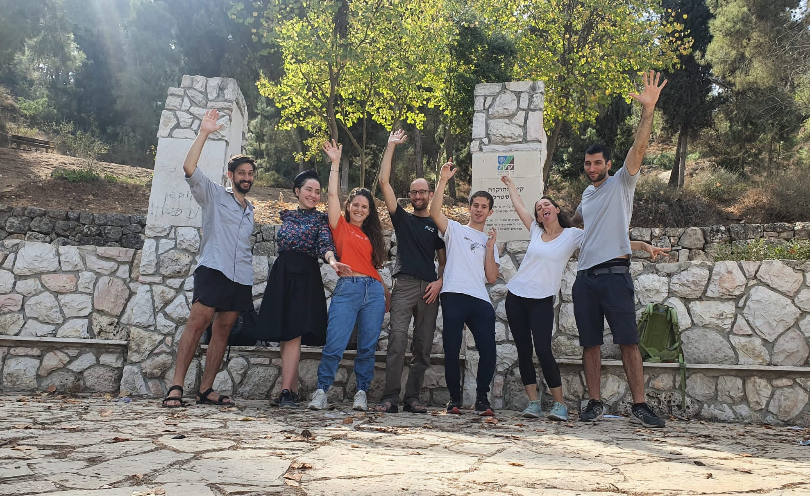

+++
# Accomplishments widget.
widget = "accomplishments"  # See https://sourcethemes.com/academic/docs/page-builder/
headless = true  # This file represents a page section.
active = true  # Activate this widget? true/false
weight = 50  # Order that this section will appear.

title = "Lab News"
subtitle = ""

# Date format
#   Refer to https://sourcethemes.com/academic/docs/customization/#date-format
date_format = "Jan 2006"

# Accomplishments.
#   Add/remove as many `[[item]]` blocks below as you like.
#   `title`, `organization` and `date_start` are the required parameters.
#   Leave other parameters empty if not required.
#   Begin/end multi-line descriptions with 3 quotes `"""`.

[[item]] 
title = "A few new papers accepted recently"
  date_start = "2022-05-15"
  description = "<ul><li>Yarden's <a href='../publication/size_bias/'>thesis paper</a> about the connection between model size and the level of gender bias was accepted to GeBNLP. Congrats to Yarden and Inbal!</li><li>Jesse's <a href='../publication/carbon/'>paper</a> on measuring the carbon intensity of AI was accepted to FAccT. Congrats to Jesse, Taylor and the rest of the team!</li><li>Roy's <a href='../publication/dont_balance/'>paper</a> with Gabi about the lost battle against spurious correlations was accepted to Findings of NAACL 2022.</li></ul>"
 

[[item]]
  title = "Our efficient NLP policy has been officially adopted by the ACL exec!"
  date_start = "2022-04-04"
  description = "See <a href='https://www.aclweb.org/adminwiki/images/7/7e/ACL_Efficient_NLP_Policy.pdf'>document link</a> for more details."

#[[item]]
#  title = "Two papers accepted to ACL 2022"
#  date_start = "2022-02-23"
#  description = "Congrats to Inbal and Hao! See <a href='publication'>Publications page</a> for more info."

[[item]]
  title = "An awesome lab event in Mt. Herzl!"
  date_start = "2021-10-29"
  description = ""

#[[item]]
#  title = "New paper accepted to EMNLP 2021, and two more accepted to Findings of EMNLP"
#  date_start = "2021-09-10"
#  description = "Congrats to Will, Yonatan, and Jesse! See <a href='publication'>Publications page</a> for more info."
#
#[[item]]
#  title = "New paper accepted to TACL"
#  date_start = "2021-04-22"
#  description = "Congrats to Will! See <a href='publication'>Publications page</a> for more info."

#[[item]]
#  title = "Two papers accepted to NAACL 2021"
#  date_start = "2021-03-10"
#  description = "Congrats to Yonatan, Tom and Aida! See <a href='publication'>Publications page</a> for more info."

#[[item]]
#  title = "Check out the new Practical AI episode about Green AI" 
#  date_start = "2021-03-01"
#  description = '<audio data-theme="night" data-src="https://changelog.com/practicalai/124/embed" src="https://cdn.changelog.com/uploads/practicalai/124/practical-ai-124.mp3" preload="none" class="changelog-episode" controls></audio>
<a href="https://changelog.com/practicalai/124">Practical AI 124: Green AI 🌲</a> – Listen on <a href="https://changelog.com/">Changelog.com</a>
And also the news coverage at <a href="https://www.nytimes.com/2019/09/26/technology/ai-computer-expense.html" target="_blank">NYT</a>, <a href="https://fortune.com/2019/07/30/artificial-intelligence-content-moderation/" target="_blank">Fortune</a>, <a href="https://www.haaretz.co.il/captain/software/.premium-1.819476" target="_blank">Haaretz</a>, and others! Click <a href="publication/greenai/">here</a> for more info.'

#[[item]]
#  title = "New paper accepted to ICLR 2021 with spotlight presentation"
#  date_start = "2021-01-12"
#  description = "Congrats to Hao! See <a href='publication'>Publications page</a> for more info."

+++
